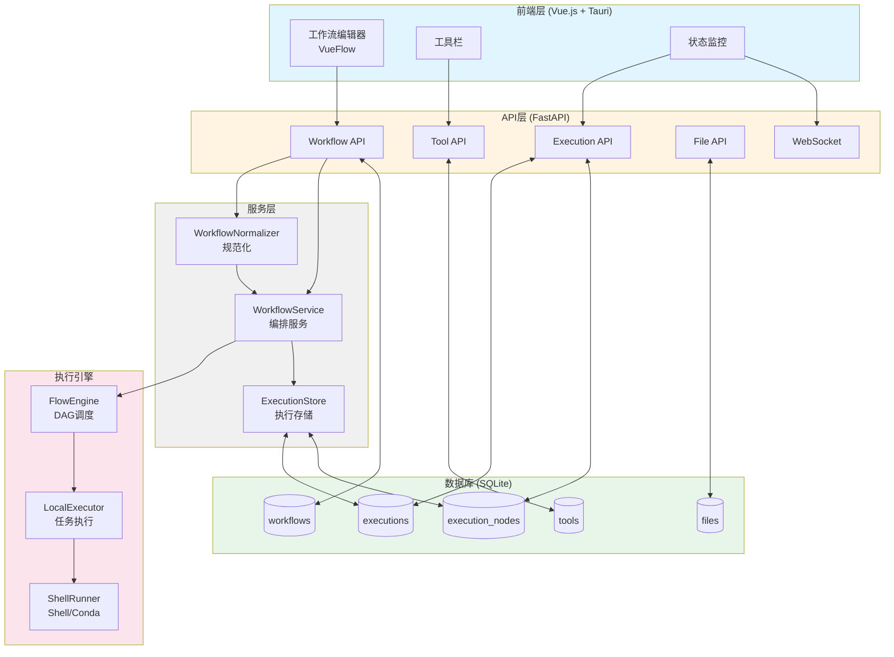
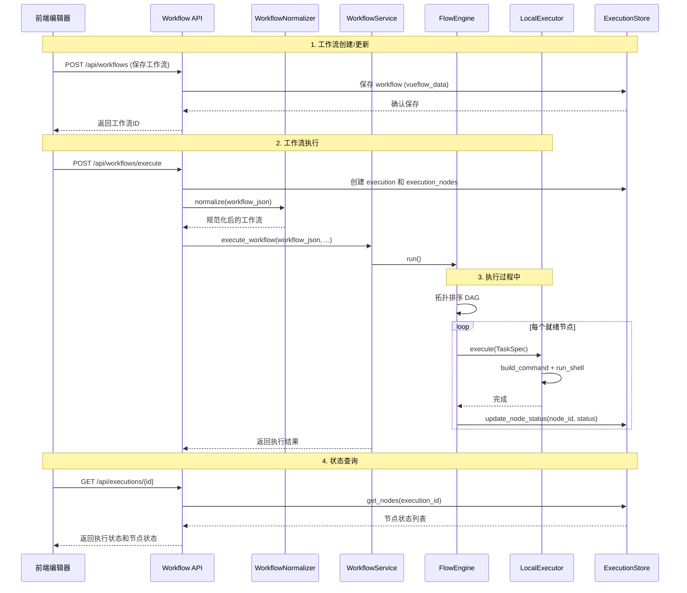

# TDEase 系统架构

## 📋 目录

- [架构概述](#架构概述)
- [技术栈](#技术栈)
- [系统架构图](#系统架构图)
- [数据流](#数据流)
- [核心组件](#核心组件)
- [数据库设计](#数据库设计)
- [执行流程](#执行流程)

---

## 架构概述

TDEase 采用前后端分离的架构设计，使用自研 FlowEngine + ShellRunner 作为工作流执行引擎，实现质谱数据处理工具的编排和执行。

### 核心架构特点

1. **前后端分离**：前端 Vue.js + Tauri，后端 FastAPI
2. **Node-based 执行**：FlowEngine 遍历 DAG，按节点调度；LocalExecutor + ShellRunner 执行命令
3. **节点级别跟踪**：每个前端节点对应执行状态，支持细粒度监控
4. **数据库驱动**：ExecutionStore 持久化执行状态，支持断点续传 (resume)
5. **跨平台支持**：Windows/Linux 全平台兼容

### 架构演进

**旧架构（已弃用）**：
```
Frontend JSON → Compiler → Snakefile + config.yaml → CLI subprocess → Snakemake
```

**当前架构**：
```
Frontend JSON → WorkflowNormalizer → WorkflowService → FlowEngine → LocalExecutor → ShellRunner (subprocess + conda run)
```

---

## 技术栈

### 后端
- **FastAPI** - 现代 Web 框架
- **FlowEngine** - 轻量级 DAG 调度器
- **ShellRunner** - Shell 命令执行（subprocess + conda run）
- **SQLite** - 轻量级数据库（可扩展到 PostgreSQL）
- **Pydantic** - 数据验证
- **WebSocket** - 实时通信

### 前端
- **Vue.js** - 前端框架
- **VueFlow** - 工作流编辑器
- **Tauri** - 桌面应用框架
- **TypeScript** - 类型安全

### 执行环境
- **Conda** - 通过 `conda run` 激活工具环境
- **Docker** - 可选，用于 msconvert_docker 等容器化工具

---

## 系统架构图

### 整体架构



### 数据流架构



---

## 数据流

### 工作流执行流程

1. **前端发送工作流 JSON** → `POST /api/workflows/execute`
2. **规范化验证** → WorkflowNormalizer + WorkflowValidator 验证 JSON 格式
3. **执行准备** → 创建 execution 记录和 execution_nodes 记录
4. **调度执行** → FlowEngine 拓扑遍历 DAG，按依赖顺序调度节点
5. **节点执行** → LocalExecutor 通过 ShellRunner 执行命令（支持 Conda）
6. **状态持久化** → ExecutionStore 更新节点状态到 SQLite
7. **断点续传** → resume 模式下检查输出文件存在则跳过已完成节点
8. **状态查询** → 前端轮询 `GET /api/executions/{id}` 获取状态

---

## 核心组件

### 1. WorkflowNormalizer (`src/workflow/normalizer.py`)
**职责**：规范化前端工作流 JSON 为统一格式

**主要方法**：
- `normalize(workflow_json)` - 规范化工作流

### 2. WorkflowValidator (`src/workflow/validator.py`)
**职责**：验证工作流格式和样本配置

**主要方法**：
- `validate(workflow_v2)` - 验证工作流

### 3. WorkflowService (`app/services/workflow_service.py`)
**职责**：工作流编排服务，协调 FlowEngine 与 ExecutionStore

**主要方法**：
- `execute_workflow(workflow_json, workspace_path, ...)` - 执行工作流
- 支持 dryrun、resume、simulate 模式

### 4. FlowEngine (`app/core/engine/scheduler.py`)
**职责**：DAG 调度器，拓扑遍历节点并调度执行

**主要方法**：
- `run()` - 主执行循环
- 维护节点状态：PENDING → READY → RUNNING → COMPLETED/FAILED/SKIPPED

### 5. LocalExecutor (`app/core/executor/local.py`)
**职责**：任务执行，从 TaskSpec 构建命令并调用 ShellRunner

**主要方法**：
- `execute(spec)` - 执行单个任务

### 6. ShellRunner (`app/core/executor/shell_runner.py`)
**职责**：Shell 命令执行，支持 Conda 环境

**主要方法**：
- `run_shell(cmd, workdir, conda_env)` - 执行命令（无 Snakemake 依赖）

### 7. ExecutionStore (`app/services/execution_store.py`)
**职责**：执行状态持久化到 SQLite

**主要方法**：
- `create(execution_id, workflow_id, workspace_path)` - 创建执行记录
- `create_node(execution_id, node_id)` - 创建节点记录
- `update_node_status(execution_id, node_id, status)` - 更新节点状态
- `get_nodes(execution_id)` - 获取所有节点状态

---

## 数据库设计

### 核心表结构

#### workflows 表
```sql
CREATE TABLE workflows (
    id TEXT PRIMARY KEY,
    name TEXT NOT NULL,
    description TEXT,
    vueflow_data TEXT NOT NULL,      -- 前端 JSON 数据
    workspace_path TEXT NOT NULL,
    status TEXT DEFAULT 'created',
    created_at TEXT NOT NULL,
    updated_at TEXT NOT NULL,
    metadata TEXT
);
```

#### executions 表
```sql
CREATE TABLE executions (
    id TEXT PRIMARY KEY,
    workflow_id TEXT NOT NULL,
    status TEXT DEFAULT 'pending',
    start_time TEXT NOT NULL,
    end_time TEXT,
    duration INTEGER,
    snakemake_args TEXT,  -- legacy column, kept for DB compat
    config_overrides TEXT,
    environment TEXT,
    workspace_path TEXT NOT NULL,
    workflow_snapshot TEXT,  -- 工作流结构快照（仅在结构变更时保存）
    created_at TEXT NOT NULL,
    FOREIGN KEY (workflow_id) REFERENCES workflows (id)
);
```

**workflow_snapshot 说明**：
- **用途**：保存执行时的工作流结构（nodes、edges），用于历史追溯和结构变更检测
- **保存时机**：
  - ✅ **结构变更时**：nodes/edges 变化、节点增删、连接关系变化
  - ❌ **参数变更时**：仅修改节点 params，不保存快照
- **好处**：
  - 可追溯每次执行使用的确切结构
  - 支持「从历史执行继续」功能
  - 区分结构变更 vs 参数变更，避免不必要的快照

#### execution_nodes 表
```sql
CREATE TABLE execution_nodes (
    id TEXT PRIMARY KEY,
    execution_id TEXT NOT NULL,
    node_id TEXT NOT NULL,
    rule_name TEXT,
    status TEXT NOT NULL DEFAULT 'pending',
    start_time TEXT,
    end_time TEXT,
    progress INTEGER DEFAULT 0,
    log_path TEXT,
    error_message TEXT,
    created_at TEXT NOT NULL,
    FOREIGN KEY (execution_id) REFERENCES executions (id)
);
```

#### tools 表
```sql
CREATE TABLE tools (
    name TEXT PRIMARY KEY,
    version TEXT,
    description TEXT,
    category TEXT,
    executable_path TEXT,
    is_available INTEGER DEFAULT 0,
    platform_info TEXT,
    parameters TEXT,
    registration_data TEXT,
    created_at TEXT NOT NULL,
    updated_at TEXT NOT NULL
);
```

完整的数据库设计参考：[DATABASE_DESIGN.md](current%20status/DATABASE_DESIGN.md)

---

## 执行流程

### 1. 初始化阶段

```python
# 检测结构变更（vs 参数变更）
from app.services.workflow_diff import has_structure_changed, get_last_execution_snapshot

workflow_snapshot = None
if has_structure_changed(last_snapshot, current_workflow):
    workflow_snapshot = json.dumps(current_workflow)  # 仅结构变更时保存

# 创建 execution 记录（包含快照）
ExecutionStore.create(execution_id, workflow_id, workspace_path, workflow_snapshot)

# 为每个节点创建 execution_node 记录
for node in workflow_json['nodes']:
    ExecutionStore.create_node(execution_id, node['id'])
```

### 2. 构建与调度阶段

```python
# WorkflowNormalizer.normalize() 规范化 JSON
# FlowEngine 从 nodes + edges 构建 WorkflowGraph
# 拓扑排序确定执行顺序
```

### 3. 执行阶段

```python
# 获取 executor plugin
# WorkflowService.execute_workflow() 内部调用 FlowEngine.run()
# FlowEngine 调度节点，LocalExecutor 执行，ExecutionStore 更新状态
```

### 4. 监控阶段

```python
# FlowEngine 的 on_node_state 回调更新 ExecutionStore
# 前端通过 API 轮询 GET /api/executions/{id} 获取状态
```

---

## 关键设计决策

### 1. 为什么自研 FlowEngine 而非 Snakemake？

**优势**：
- 轻量级，无沉重依赖
- 完全契合 Node-based、数据库驱动的执行模型
- 原生支持断点续传 (resume)
- 更易维护和扩展

### 2. 为什么使用节点级别跟踪？

**优势**：
- 细粒度监控
- 支持部分重执行
- 更好的错误定位
- Hot Run 模式基础

### 3. 为什么选择 SQLite？

**优势**：
- 轻量级，无服务器
- 跨平台兼容
- 易于备份和迁移
- 足够的性能（中小规模）

**扩展路径**：
- 大规模部署可迁移到 PostgreSQL
- 使用 SQLAlchemy ORM 抽象数据库层

### 4. 工作流结构快照（workflow_snapshot）机制

**问题**：用户运行工作流后，可能修改 JSON 结构（增删节点、改连接），也可能只调整参数。如何区分？

**解决方案**：`workflow_snapshot` 机制

| 变更类型 | 检测方式 | 是否保存快照 | 说明 |
|---------|---------|------------|------|
| **结构变更** | nodes/edges 变化 | ✅ 保存 | 节点增删、连接关系变化、节点类型变化 |
| **参数变更** | 仅 params 变化 | ❌ 不保存 | 仅修改节点参数值，结构不变 |

**实现**：
- `app/services/workflow_diff.py`：`has_structure_changed()` 比较结构（忽略 params）
- 执行时：比较当前结构与上次快照，结构变更则保存新快照
- `executions.workflow_snapshot`：存储 JSON 字符串，用于历史追溯

**好处**：
- ✅ 可追溯每次执行使用的确切结构
- ✅ 支持「从历史执行继续」功能
- ✅ 避免参数调整时产生冗余快照
- ✅ 区分结构变更 vs 参数变更，便于调试和审计

---

## 相关文档

- [API 端点文档](api/endpoints.md)
- [工作流格式说明](guides/workflow-format.md)
- [数据库设计](current%20status/DATABASE_DESIGN.md)
- [节点执行与同步方案](plan/node_execution_and_sync.md)
