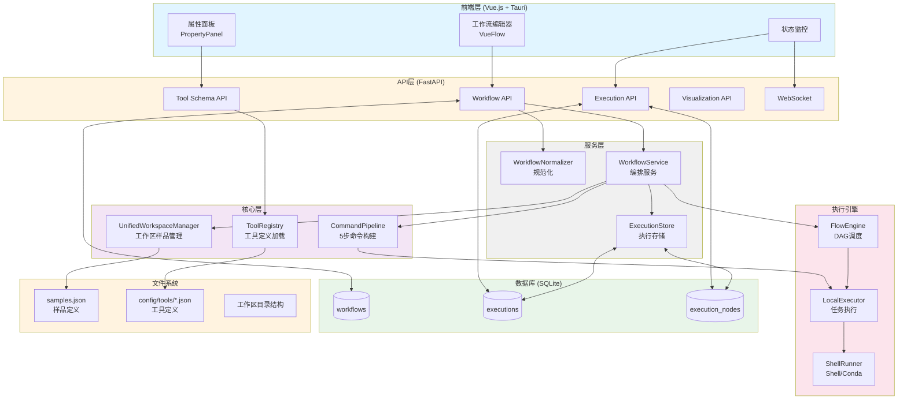
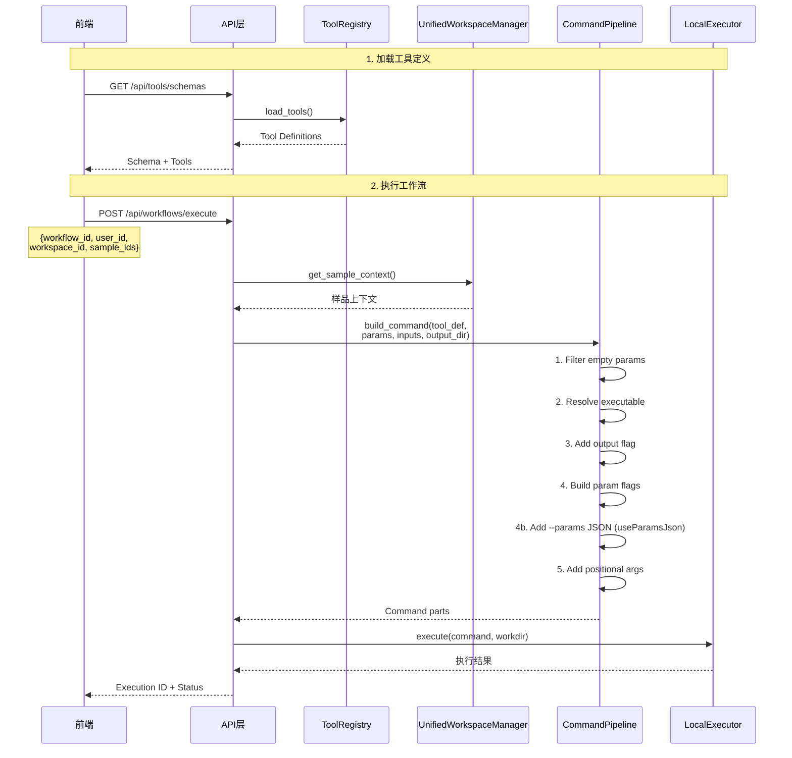

# TDEase 系统架构

**更新日期**: 2026-03-02
**版本**: 2.0 (新架构)

## 目录

- [架构概述](#架构概述)
- [新架构核心变化](#新架构核心变化)
- [技术栈](#技术栈)
- [系统架构图](#系统架构图)
- [数据流](#数据流)
- [核心组件](#核心组件)
- [数据库设计](#数据库设计)
- [执行流程](#执行流程)

---

## 架构概述

TDEase 采用前后端分离的架构设计，使用自研 FlowEngine + ShellRunner 作为工作流执行引擎，实现质谱数据处理工具的编排和执行。

**新架构（2.0）核心特点**：
1. **Schema-Driven**: Tool Definition Schema 作为单一数据源
2. **Command Pipeline**: 5步管道构建命令，消除分支逻辑
3. **Structured Samples**: samples.json 结构化样品管理
4. **Workspace Hierarchy**: users → workspaces → samples 层级结构

---

## 新架构核心变化

### 1. Tool Definition Schema (D1)


**新方式**：统一的 Tool Definition Schema
```json
{
  "id": "topfd",
  "executionMode": "native",
  "command": {"executable": "topfd"},
  "ports": {
    "inputs": [{"id": "ms2_file", "dataType": "ms2", "required": true}],
    "outputs": [{"id": "ms1_file", "pattern": "{sample}_ms1.msalign"}]
  },
  "parameters": {
    "mass": {"flag": "-m", "type": "value", "default": "50000"}
  }
}
```

**好处**：
- 前后端共享同一Schema
- 消除定义不一致
- 支持多种执行模式

### 2. Command Pipeline (D2)

**旧方式**：分支逻辑
```python
if tool_type == "command":
    # 分支逻辑...
elif tool_type == "script":
    # 不同分支...
```

**新方式**：5步管道
```python
CommandPipeline(tool_def).build(params, inputs, output_dir)
# Step 1: Filter (移除null/empty/"none")
# Step 2: Executable (解析可执行命令)
# Step 3: Output Flag (添加输出标志)
# Step 4: Parameters (构建参数标志)
# Step 5: Positional (添加位置参数)
```

**好处**：
- 统一参数过滤
- 无类型分支
- 易于扩展新执行模式

### 3. Structured Samples (D3)

**旧方式**：内联扁平字典
```json
{
  "parameters": {
    "sample_context": {
      "sample": "sample1",
      "fasta_filename": "db"
    }
  }
}
```

**新方式**：samples.json 结构化存储
```json
{
  "samples": {
    "sample1": {
      "id": "sample1",
      "context": {
        "sample": "sample1",
        "fasta_filename": "UniProt_sorghum_focus1"
      },
      "data_paths": {
        "raw": "data/raw/file.raw",
        "fasta": "data/fasta/db.fasta"
      }
    }
  }
}
```

**好处**：
- 工作区级别共享
- 支持元数据和路径
- 自动推导占位符

### 4. 前端参数渲染 (D4)

**旧方式**：前端硬编码参数类型
```javascript
if (param.type === "boolean")
  // 渲染开关
```

**新方式**：从 Tool Definition 读取
```vue
<template v-for="(p, key) in parameters">
  <el-input v-if="p.type === 'value'" />
  <el-switch v-else-if="p.type === 'boolean'" />
  <el-select v-else-if="p.type === 'choice'" />
</template>
```

**好处**：
- 前端无需硬编码
- 工具定义即文档

---

## 技术栈

### 后端
- **FastAPI** - 现代 Web 框架
- **FlowEngine** - 轻量级 DAG 调度器
- **CommandPipeline** - 5步命令构建管道
- **UnifiedWorkspaceManager** - 工作区和样品管理
- **ShellRunner** - Shell 命令执行（subprocess + conda run）
- **SQLite** - 轻量级数据库
- **Pydantic** - 数据验证
- **WebSocket** - 实时通信

### 前端
- **Vue.js** - 前端框架
- **VueFlow** - 工作流编辑器
- **Tauri** - 桌面应用框架
- **TypeScript** - 类型安全

### 执行环境
- **Conda** - 通过 `conda run` 激活工具环境
- **Docker** - 可选，用于容器化工具

---

## 系统架构图

### 整体架构



### 新架构数据流



---

## 数据流

### 工作流执行流程（新架构）

1. **前端加载工具定义** → `GET /api/tools/schemas`
2. **前端发送执行请求** → `POST /api/workflows/execute`
   - 请求体: `{workflow_id, user_id, workspace_id, sample_ids}`
3. **后端加载样品上下文** → `UnifiedWorkspaceManager.get_sample_context()`
   - 从 `samples.json` 读取结构化样品数据
   - 自动推导占位符（basename, dir, extension等）
4. **命令构建** → `CommandPipeline.build()`
   - Step 1: 过滤空参数（null/empty/"none"）
   - Step 2: 解析可执行命令（native/script/uv）
   - Step 3: 添加输出标志（如果 flagSupported）
   - Step 4: 构建参数标志（value/boolean/choice）
   - Step 4b: 若 useParamsJson，追加 --params JSON（供 data_loader 等传递 sample_name）
   - Step 5: 添加位置参数（按 positionalOrder）
5. **调度执行** → FlowEngine 拓扑遍历 DAG
6. **节点执行** → LocalExecutor 通过 ShellRunner 执行
7. **状态持久化** → ExecutionStore 更新到 SQLite
8. **状态查询** → 前端查询 `GET /api/executions/{id}`
9. **执行监控** → 前端通过 WebSocket (`/ws/executions/{id}`) 实时接收状态与日志；若 WebSocket 不可用则降级为每 2 秒轮询。当状态为 `completed`/`failed`/`cancelled` 时自动停止监控。

---

## 核心组件

### 1. ToolRegistry (`app/services/tool_registry.py`)

**职责**：加载和管理工具定义

**主要方法**：
- `load_tools()` - 从 `config/tools/*.json` 加载所有工具
- `get_tool(tool_id)` - 获取单个工具定义
- `validate_tool(tool_def)` - 验证工具Schema

**工具定义格式**：
```json
{
  "id": "tool_id",
  "name": "Tool Name",
  "version": "1.0.0",
  "executionMode": "native|script|docker|interactive",
  "command": {
    "executable": "command_name",
    "interpreter": "python"  // for script mode
  },
  "ports": {
    "inputs": [...],
    "outputs": [...]
  },
  "parameters": {...},
  "output": {
    "flagSupported": false  // for TopPIC/TopFD
  }
}
```

### 2. CommandPipeline (`app/core/executor/command_pipeline.py`)

**职责**：5步命令构建管道

**主要方法**：
- `build(param_values, input_files, output_dir)` - 构建完整命令
- `_filter_empty_params()` - Step 1: 过滤空参数
- `_resolve_executable()` - Step 2: 解析可执行命令
- `_build_output_flag()` - Step 3: 构建输出标志
- `_build_parameter_flags()` - Step 4: 构建参数标志
- Step 4b: 若工具定义 `useParamsJson: true`，追加 `--params` JSON
- `_build_positional_args()` - Step 5: 构建位置参数

LocalExecutor 将 `spec.input_paths` 按 positionalOrder 映射到端口 ID，保证与 `_resolve_input_paths` 返回顺序一致。

**Sample 传递与命令执行细节**：
- 执行入口 `parameters.sample_context` 来自 API 的 `get_sample_context()`；**sample 统一使用 sample_id / context 显式值，不按 raw 文件名 basename 兜底**，由前端保证正确。
- `build_task_spec` 对 data_loader 注入 `sample_name = sample_context["sample"]`，数据导入第一步统一使用该名称写出文件；后续工具若不支持指定输出文件名则自行统配。
- data_loader 工具定义 `useParamsJson: true`，CommandPipeline 会追加 `--params` JSON；内部键 `tool_type`/`type` 已过滤。
- 下游节点输入路径由 `_resolve_input_paths` 从 `completed_outputs[上游]` 按 edge 的 targetHandle 与 positionalOrder 传入 LocalExecutor。

### 3. UnifiedWorkspaceManager (`app/services/unified_workspace_manager.py`)

**职责**：工作区和样品管理

**主要方法**：
- `get_sample_context(user_id, workspace_id, sample_id)` - 获取样品上下文
- `get_workspace_path(user_id, workspace_id)` - 获取工作区路径
- `list_samples(user_id, workspace_id)` - 列出工作区所有样品

**目录结构**：
```
data/
└── users/
    └── {user_id}/
        └── workspaces/
            └── {workspace_id}/
                ├── samples.json           # 样品定义
                ├── workflows/             # 工作流定义
                ├── executions/            # 执行记录
                └── data/                  # 数据文件
                    ├── raw/
                    ├── fasta/
                    └── reference/
```

**samples.json 格式**：
```json
{
  "samples": {
    "sample1": {
      "id": "sample1",
      "name": "Sample 1",
      "description": "Test sample",
      "context": {
        "sample": "sample1",
        "fasta_filename": "UniProt_sorghum_focus1"
      },
      "data_paths": {
        "raw": "data/raw/Sorghum-Histone0810162L20.raw",
        "fasta": "data/fasta/UniProt_sorghum_focus1.fasta"
      }
    }
  }
}
```

### 4. WorkflowNormalizer (`src/workflow/normalizer.py`)

**职责**：规范化前端工作流 JSON

**主要方法**：
- `normalize(workflow_json)` - 规范化工作流
- 保留 `input-`/`output-` 端口前缀语义

### 5. WorkflowService (`app/services/workflow_service.py`)

**职责**：工作流编排服务

**路径解析**（新 Schema）：
- 输出：`ports.outputs`（或兼容 `output_patterns`）→ `_resolve_output_paths`
- 输入：`ports.inputs` 的 `positional`/`positionalOrder`（或兼容 `positional_params`）→ `_resolve_input_paths`

**主要方法**：
- `execute_workflow(workflow_json, workspace_path, parameters)` - 执行工作流
- 支持 dryrun、resume、simulate 模式
- `parameters.sample_context` 由 API 从 samples.json 注入或兼容旧格式

### 6. FlowEngine (`app/core/engine/scheduler.py`)

**职责**：DAG 调度器

**主要方法**：
- `run()` - 主执行循环
- 拓扑排序节点
- 维护节点状态：PENDING → READY → RUNNING → COMPLETED/FAILED/SKIPPED

### 7. LocalExecutor (`app/core/executor/local.py`)

**职责**：任务执行

**主要方法**：
- `execute(spec)` - 执行单个任务
- 使用 `CommandPipeline.build()` 构建命令
- 调用 `ShellRunner.run_shell()` 执行

### 8. ExecutionStore (`app/services/execution_store.py`)

**职责**：执行状态持久化

**主要方法**：
- `create(execution_id, ...)` - 创建执行记录
- `create_node(execution_id, node_id)` - 创建节点记录
- `update_node_status(...)` - 更新节点状态
- `get_nodes(execution_id)` - 获取所有节点状态

---

## 数据库设计

### 核心表结构

#### workflows 表
```sql
CREATE TABLE workflows (
    id TEXT PRIMARY KEY,
    name TEXT NOT NULL,
    description TEXT,
    vueflow_data TEXT NOT NULL,
    workspace_path TEXT NOT NULL,
    status TEXT DEFAULT 'created',
    created_at TEXT NOT NULL,
    updated_at TEXT NOT NULL,
    metadata TEXT
);
```

#### executions 表
```sql
CREATE TABLE executions (
    id TEXT PRIMARY KEY,
    workflow_id TEXT NOT NULL,
    status TEXT DEFAULT 'pending',
    start_time TEXT NOT NULL,
    end_time TEXT,
    duration INTEGER,
    workspace_path TEXT NOT NULL,
    workflow_snapshot TEXT,
    created_at TEXT NOT NULL,
    FOREIGN KEY (workflow_id) REFERENCES workflows (id)
);
```

#### execution_nodes 表
```sql
CREATE TABLE execution_nodes (
    id TEXT PRIMARY KEY,
    execution_id TEXT NOT NULL,
    node_id TEXT NOT NULL,
    status TEXT NOT NULL DEFAULT 'pending',
    start_time TEXT,
    end_time TEXT,
    progress INTEGER DEFAULT 0,
    error_message TEXT,
    created_at TEXT NOT NULL,
    FOREIGN KEY (execution_id) REFERENCES executions (id)
);
```

---

## 执行流程

### 新架构执行示例

```python
# 1. 前端请求执行
POST /api/workflows/execute
{
  "workflow_id": "wf_test_full",
  "user_id": "test_user",
  "workspace_id": "test_workspace",
  "sample_ids": ["sample1"]
}

# 2. 后端处理流程
# app/api/workflow.py
def execute_workflow(request):
    # 加载样品上下文
    manager = get_unified_workspace_manager()
    context = manager.get_sample_context(
        user_id, workspace_id, sample_id
    )
    # context = {"sample": "sample1", "fasta_filename": "UniProt_sorghum_focus1"}

    # 执行工作流
    result = workflow_service.execute_workflow(
        workflow_json=workflow,
        workspace_path=workspace_path,
        sample_context=context,
        ...
    )

# 3. WorkflowService 执行
# app/services/workflow_service.py
def execute_workflow(workflow_json, sample_context, ...):
    for node in workflow_json['nodes']:
        # 构建命令
        tool_def = tool_registry.get_tool(node['toolId'])
        pipeline = CommandPipeline(tool_def)

        cmd_parts = pipeline.build(
            param_values=node['paramValues'],
            input_files=input_files,
            output_dir=output_dir
        )

        # 执行命令
        result = local_executor.execute(cmd_parts)

    return result

# 4. CommandPipeline 构建
# app/core/executor/command_pipeline.py
def build(self, param_values, input_files, output_dir):
    # Step 1: Filter empty params
    filtered = self._filter_empty_params(param_values)

    # Step 2: Resolve executable
    cmd = [self._resolve_executable()]

    # Step 3: Output flag
    if self.output_config.get("flagSupported"):
        cmd.extend(["-o", output_dir])

    # Step 4: Parameter flags
    cmd.extend(self._build_parameter_flags(filtered))

    # Step 5: Positional args
    cmd.extend(self._build_positional_args(input_files))

    return cmd
```

---

## 相关文档

- [API 文档](api/endpoints.md) - RESTful API 端点说明
- [API 使用示例](API_USAGE_NEW_ARCHITECTURE.md) - 新架构 API 调用示例
- [工作流格式说明](guides/workflow-format.md) - VueFlow JSON 格式
- [工作空间管理](guides/workspace-management.md) - 文件传递和路径管理
- [工具注册指南](guides/tool-registration.md) - 如何添加新工具
