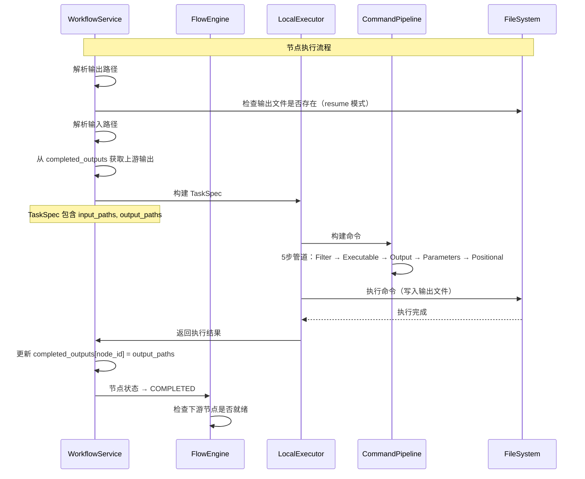
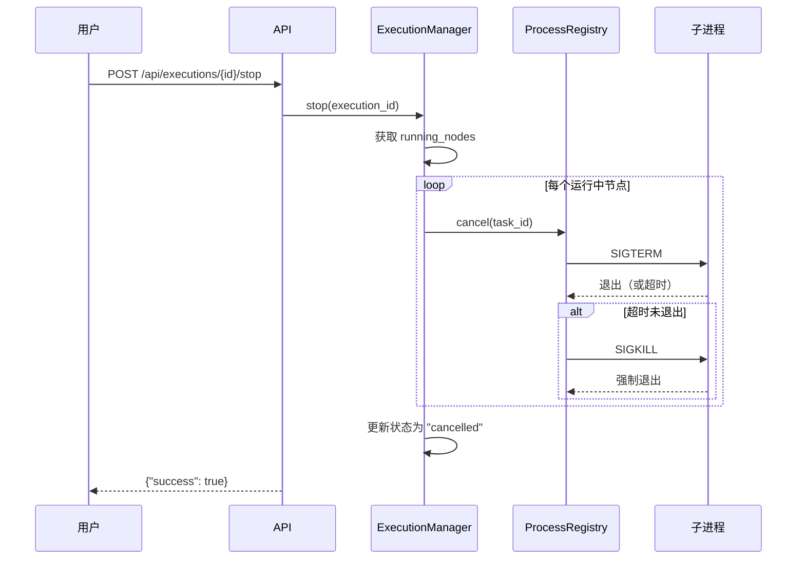

# 工作流执行机制详解

**更新日期**: 2026-03-04
**版本**: 1.1

## 目录

- [概述](#概述)
- [执行流程](#执行流程)
- [工具后端映射](#工具后端映射)
- [文件追踪机制](#文件追踪机制)
- [命令构建](#命令构建)
- [状态管理](#状态管理)
- [取消机制](#取消机制)

---

## 概述

TDEase 的工作流执行采用 DAG（有向无环图）调度模型，通过 FlowEngine 协调节点执行，WorkflowService 编排任务，LocalExecutor 执行具体命令。

### 核心组件

| 组件 | 职责 | 位置 |
|------|------|------|
| **FlowEngine** | DAG 调度器，拓扑排序，状态管理 | `app/core/engine/scheduler.py` |
| **WorkflowService** | 工作流编排，任务规格构建 | `app/services/workflow_service.py` |
| **LocalExecutor** | 任务执行，命令运行 | `app/core/executor/local.py` |
| **CommandPipeline** | 命令构建，5步管道 | `app/core/executor/command_pipeline.py` |
| **ToolRegistry** | 工具定义加载和查询 | `app/services/tool_registry.py` |
| **ProcessRegistry** | 进程注册表，支持取消 | `app/core/executor/process_registry.py` |

---

## 执行流程

### 1. 入口：API 请求

```
POST /api/workflows/execute
{
  "workflow_id": "wf_test_full",
  "user_id": "test_user",
  "workspace_id": "test_workspace",
  "sample_ids": ["sample1"]
}
```

### 2. WorkflowService 执行流程

#### 2.1 加载和规范化

```python
# app/api/workflow.py
async def execute_workflow(request):
    # 1. 从数据库加载工作流定义
    workflow = await workflow_store.get(workflow_id)

    # 2. 从 samples.json 加载样品上下文
    context = workspace_manager.get_sample_context(
        user_id, workspace_id, sample_id
    )

    # 3. 调用 WorkflowService
    result = await workflow_service.execute_workflow(
        workflow_json=workflow,
        workspace_path=workspace_path,
        parameters={"sample_context": context},
        execution_id=execution_id,
        workflow_id=workflow_id
    )
```

#### 2.2 规范化和验证

```python
# app/services/workflow_service.py
async def execute_workflow(...):
    # 1. 规范化工作流 JSON
    wf = WorkflowNormalizer().normalize(workflow_json)

    # 2. 验证工作流
    vres = WorkflowValidator().validate(wf)
    if vres.get("errors"):
        return {"status": "failed", "error": "..."}

    # 3. 准备执行上下文
    ctx = ExecutionContext(
        workspace_path=workspace_path,
        sample_context=sample_context,
        execution_id=execution_id,
        ...
    )
```

#### 2.3 构建节点执行函数

```python
def build_task_spec(nid: str, node_data: Dict, ctx: ExecutionContext) -> TaskSpec:
    """为每个节点构建执行规格"""
    tool_id = node_data.get("type", "")
    tool_info = tools.get(tool_id, {})

    # 跳过交互式节点
    if tool_info.get("executionMode") == "interactive":
        return None

    # 生成 task_id: {execution_id}:{node_id}
    task_id = f"{ctx.execution_id}:{nid}"

    # 解析输出路径
    output_paths = _resolve_output_paths(
        nid, tool_id, tool_info,
        ctx.sample_context,
        ctx.workspace_path
    )

    # 解析输入路径（从已完成节点）
    input_files = _resolve_input_paths(
        nid, edges, nodes_map, tools,
        ctx.sample_context, ctx.workspace_path,
        completed_outputs,
        target_tool_id=tool_id
    )

    # 构建 TaskSpec
    return TaskSpec(
        node_id=nid,
        tool_id=tool_id,
        params=node_data.get("params", {}),
        input_paths=input_paths_list,
        input_files=input_files_dict,
        output_paths=output_paths,
        workspace_path=ctx.workspace_path,
        task_id=task_id,
        ...
    )
```

### 3. FlowEngine 调度循环

```python
# app/core/engine/scheduler.py
async def _execute_loop(self):
    """主执行循环"""
    while not self._cancelled and not self.graph.all_done():
        # 1. 标记就绪节点
        self._mark_ready()

        # 2. 获取就绪节点
        ready = self.graph.get_ready_nodes()

        # 3. 检查断点续传
        for nid in ready:
            if self.context.resume:
                if self._output_check_fn(nid, node_data, ctx):
                    # 输出文件存在，跳过
                    self.graph.set_state(nid, NodeState.SKIPPED)
                    continue

        # 4. 并发执行就绪节点
        tasks = [self._run_node(nid, node) for nid in ready]
        results = await asyncio.gather(*tasks, return_exceptions=True)

    return self._collect_result()
```

### 4. 节点执行流程

```python
async def _run_node(self, nid: str, node) -> None:
    """执行单个节点"""
    # 1. 更新状态为 RUNNING
    self.graph.set_state(nid, NodeState.RUNNING)
    self._on_node_state(nid, "running")

    # 2. 调用执行函数
    try:
        await self._execute_fn(nid, node.data, self.context)

        # 3. 更新状态为 COMPLETED
        self.graph.set_state(nid, NodeState.COMPLETED)
        self._on_node_state(nid, "completed")
    except Exception as e:
        # 4. 更新状态为 FAILED
        self.graph.set_state(nid, NodeState.FAILED, error=str(e))
        self._on_node_state(nid, "failed")
        raise
```

### 5. LocalExecutor 执行

```python
# app/core/executor/local.py
async def execute(self, spec: TaskSpec) -> None:
    """执行任务规格"""
    tool_info = self.tools_registry.get(spec.tool_id, {})

    # 1. 构建命令
    pipeline = CommandPipeline(tool_info)
    cmd_parts = pipeline.build(
        param_values=spec.params,
        input_files=spec.input_files,
        output_dir=str(spec.output_paths[0].parent)
    )

    # 2. 执行命令
    conda_env = spec.conda_env or tool_info.get("conda_env")
    await asyncio.to_thread(
        _run_shell,
        cmd_parts,
        spec.workspace_path,
        conda_env,
        spec.log_callback,
        spec.task_id
    )
```

### 6. ShellRunner 运行

```python
# app/core/executor/shell_runner.py
def run_shell(cmd: str, workdir: Path, conda_env: str = None, task_id: str = ""):
    """运行 Shell 命令"""
    # 1. 构建命令
    if conda_env:
        cmd = f"conda run -n {conda_env} {cmd}"

    # 2. 创建子进程
    process = subprocess.Popen(
        cmd,
        cwd=workdir,
        shell=True,
        stdout=subprocess.PIPE,
        stderr=subprocess.STDOUT
    )

    # 3. 注册进程（用于取消）
    if task_id:
        process_registry.register(task_id, process)

    try:
        # 4. 捕获输出
        for line in process.stdout:
            if log_callback:
                log_callback(line.decode().strip())
    finally:
        # 5. 注销进程
        if task_id:
            process_registry.unregister(task_id)
```

### 7. 实时日志与状态推送

- 执行状态：由 `_run_workflow_background()` 调用 `app.core.websocket.manager.broadcast_to_execution()` 推送 `status` 消息
- 命令行日志：`ShellRunner` 逐行回调 `log_callback`，后端同时
  - 追加到 `execution_manager.logs`（供 `/api/executions/{id}` 轮询）
  - 通过同一 WebSocket manager 推送 `log` 消息（供前端实时显示）
- WebSocket 路由：`/ws/executions/{execution_id}`

---

## 工具后端映射

### 工具定义结构

每个工具在 `config/tools/*.json` 中定义：

```json
{
  "id": "topfd",
  "name": "TopFD",
  "version": "1.8.0",
  "description": "TopFD: Deconvolute mass spectra",
  "executionMode": "native|script|docker|interactive",
  "command": {
    "executable": "topfd",
    "interpreter": "python",  // for script mode
    "useUv": false           // optional
  },
  "ports": {
    "inputs": [...],
    "outputs": [...]
  },
  "parameters": {...},
  "output": {
    "flagSupported": false,
    "flag": "-o"
  },
  "conda_env": "toppic"  // optional
}
```

### 执行模式映射

| executionMode | 命令构建 | 说明 |
|---------------|---------|------|
| **native** | 直接使用 `executable` | 原生命令（如 topfd.exe） |
| **script** | `interpreter executable` | Python/R/Bash 脚本 |
| **docker** | `docker run <image>` | Docker 容器 |
| **interactive** | 跳过执行 | 前端交互式节点 |

### 示例：不同执行模式的命令

#### Native 模式
```json
{
  "executionMode": "native",
  "command": {"executable": "topfd"}
}
```
生成命令：`topfd -a 21.0 input.msalign`

#### Script 模式
```json
{
  "executionMode": "script",
  "command": {
    "executable": "src/nodes/data_loader.py",
    "interpreter": "python"
  }
}
```
生成命令：`python src/nodes/data_loader.py --input file.raw`

#### Script 模式 + uv
```json
{
  "executionMode": "script",
  "command": {
    "executable": "src/nodes/data_loader.py",
    "interpreter": "python",
    "useUv": true
  }
}
```
生成命令：`uv run src/nodes/data_loader.py --input file.raw`

#### Interactive 模式
```json
{
  "executionMode": "interactive"
}
```
不生成命令，节点在执行时被跳过

### 工具注册流程

```python
# app/services/tool_registry.py
class ToolRegistry:
    def load_tools(self):
        """从 config/tools/ 加载所有工具定义"""
        tools_dir = Path("config/tools")
        for json_file in tools_dir.glob("*.json"):
            tool_def = json.loads(json_file.read_text())
            self._tools[tool_def["id"]] = tool_def

    def get_tool(self, tool_id: str) -> Dict:
        """获取工具定义"""
        return self._tools.get(tool_id)

    def list_tools(self) -> Dict[str, Dict]:
        """获取所有工具"""
        return self._tools
```

---

## 文件追踪机制

### 1. 输出路径推导

#### 函数：`_resolve_output_paths()`

```python
# app/services/workflow_service.py
def _resolve_output_paths(
    node_id: str,
    tool_id: str,
    tool_info: Dict,
    sample_context: Dict,
    workspace_path: Path
) -> List[Path]:
    """推导输出文件路径"""
    outputs = tool_info.get("ports", {}).get("outputs", [])
    output_dir = workspace_path / "executions" / execution_id / "results"

    paths = []
    for output_def in outputs:
        pattern = output_def.get("pattern", "")
        # 替换占位符
        filename = pattern.format(**sample_context)
        path = output_dir / filename
        paths.append(path)

    return paths
```

#### 占位符替换

| 占位符 | 来源 | 示例值 |
|--------|------|--------|
| `{sample}` | `sample_context["sample"]` | `sample1` |
| `{input_ext}` | 输入文件扩展名 | `.mzML` |
| `{basename}` | 输入文件名（无扩展名） | `Sorghum-Histone0810162L20` |
| `{fasta_filename}` | `sample_context["fasta_filename"]` | `UniProt_sorghum_focus1` |

#### 示例

```python
# 工具定义
{
  "ports": {
    "outputs": [
      {"pattern": "{sample}_ms1.msalign"}
    ]
  }
}

# sample_context
{"sample": "sample1"}

# 推导结果
output_path = "executions/exec_123/results/sample1_ms1.msalign"
```

### 2. 输入路径解析

#### 函数：`_resolve_input_paths()`

```python
def _resolve_input_paths(
    node_id: str,
    edges: List[Dict],
    nodes_map: Dict,
    tools_registry: Dict,
    sample_context: Dict,
    workspace: Path,
    completed_outputs: Dict[str, List[Path]],
    target_tool_id: str
) -> Dict[str, Path]:
    """解析输入路径：port_id -> Path"""
    param_to_path = {}

    for edge in edges:
        if edge["target"] != node_id:
            continue

        # 获取连接信息
        src_id = edge["source"]
        src_handle = edge["sourceHandle"].replace("output-", "")
        tgt_handle = edge["targetHandle"].replace("input-", "")

        # 查找真实源节点（穿越交互式节点）
        real_src_id = find_real_source(src_id, set())
        if not real_src_id:
            continue

        # 获取源节点输出
        src_outputs = completed_outputs[real_src_id]
        src_tool_info = tools_registry[src_node["data"]["type"]]
        patterns = _get_output_patterns(src_tool_info)

        # 匹配输出文件
        matched_idx = match_output_by_handle(src_handle, patterns)
        if matched_idx is not None:
            param_to_path[tgt_handle] = src_outputs[matched_idx]

    return param_to_path
```

#### 匹配策略

1. **handle 精确匹配**：`src_handle` 与输出端口的 `handle` 完全一致
2. **dataType 匹配**：`src_handle` 与输出端口的 `dataType` 一致
3. **默认匹配**：无 `src_handle` 时使用第一个输出

#### 交互式节点穿越

```python
def find_real_source(interactive_src_id: str, visited: set) -> Optional[str]:
    """递归查找真实的非交互式源节点"""
    if interactive_src_id in completed_outputs:
        return interactive_src_id

    src_node = nodes_map.get(interactive_src_id, {})
    src_tool_info = tools_registry[src_node["data"]["type"]]

    # 如果是交互式节点，继续向上游查找
    if src_tool_info.get("executionMode") == "interactive":
        for edge in edges:
            if edge["target"] == interactive_src_id:
                return find_real_source(edge["source"], visited)

    return None
```

### 3. 文件追踪流程图



### 4. completed_outputs 追踪

```python
# WorkflowService.execute_workflow()
completed_outputs: Dict[str, List[Path]] = {}

async def execute_fn(nid: str, node_data: Dict, ctx: ExecutionContext) -> None:
    spec = build_task_spec(nid, node_data, ctx)

    # 执行任务
    await executor.execute(spec)

    # 记录输出文件（供下游节点使用）
    completed_outputs[nid] = spec.output_paths
```

---

## 命令构建

### CommandPipeline 5步管道

#### Step 1: Filter（过滤空参数）

```python
def _filter_empty_params(self, params: Dict) -> Dict:
    """移除 null/empty/"none" 值"""
    filtered = {}
    for key, value in params.items():
        if value is None:
            continue
        if isinstance(value, str) and value.strip() == "":
            continue
        if isinstance(value, str) and value.strip().lower() == "none":
            continue
        filtered[key] = value
    return filtered
```

#### Step 2: Executable（解析可执行命令）

```python
def _resolve_executable(self) -> str:
    """根据 executionMode 解析命令"""
    if self.execution_mode == "native":
        return self.command_config.get("executable", "")

    elif self.execution_mode == "script":
        executable = self.command_config.get("executable", "")
        interpreter = self.command_config.get("interpreter", "")
        use_uv = self.command_config.get("useUv", False)

        if interpreter == "python":
            if use_uv:
                return f"uv run {executable}"
            else:
                return f"python {executable}"

    elif self.execution_mode == "docker":
        return "docker"

    return ""
```

#### Step 3: Output（添加输出标志）

```python
if output_dir and self.output_config.get("flagSupported"):
    output_flag = self.output_config.get("flag", "-o")
    output_value = self.output_config.get("flagValue", output_dir)
    cmd_parts.extend([output_flag, output_value])
```

#### Step 4: Parameters（构建参数标志）

```python
def _build_parameter_flags(self, params: Dict) -> List[str]:
    """构建参数标志"""
    flags = []
    for key, value in params.items():
        param_def = self.parameters.get(key, {})
        flag = param_def.get("flag", f"--{key}")
        param_type = param_def.get("type", "value")

        if param_type == "boolean":
            if value:
                flags.append(flag)
        elif param_type == "value":
            flags.extend([flag, str(value)])
        elif param_type == "choice":
            flags.extend([flag, str(value)])

    return flags
```

#### Step 5: Positional（添加位置参数）

```python
def _build_positional_args(self, input_files: Dict[str, str]) -> List[str]:
    """构建位置参数"""
    inputs = self.ports.get("inputs", [])
    positional_inputs = [
        i for i in inputs
        if isinstance(i, dict) and i.get("positional", False)
    ]
    positional_inputs.sort(key=lambda x: x.get("positionalOrder", 0))

    args = []
    for port_def in positional_inputs:
        port_id = port_def.get("id")
        if port_id in input_files:
            args.append(input_files[port_id])

    return args
```

### 完整示例

#### 输入

```python
# 工具定义
{
  "id": "topfd",
  "executionMode": "native",
  "command": {"executable": "topfd"},
  "ports": {
    "inputs": [
      {"id": "input_files", "positional": true, "positionalOrder": 0}
    ]
  },
  "parameters": {
    "activation": {"flag": "-a", "type": "value"},
    "max_charge": {"flag": "-c", "type": "value"}
  }
}

# 用户参数
param_values = {
    "activation": "21.0",
    "max_charge": "50",
    "max_mass": ""  # 空值，会被过滤
}

# 输入文件
input_files = {
    "input_files": "sample1.mzML"
}
```

#### 输出

```python
# Step 1: Filter
{"activation": "21.0", "max_charge": "50"}

# Step 2: Executable
["topfd"]

# Step 3: Output（flagSupported = false）
无变化

# Step 4: Parameters
["-a", "21.0", "-c", "50"]

# Step 5: Positional
["sample1.mzML"]

# 最终命令
["topfd", "-a", "21.0", "-c", "50", "sample1.mzML"]
```

---

## 状态管理

### 节点状态机

```
PENDING → READY → RUNNING → COMPLETED
                    ↓
                  FAILED
                    ↓
                 SKIPPED (resume mode)
```

### 状态转换触发

| 触发条件 | 状态转换 |
|---------|---------|
| 节点创建 | → PENDING |
| 依赖完成 | PENDING → READY |
| 开始执行 | READY → RUNNING |
| 执行成功 | RUNNING → COMPLETED |
| 执行失败 | RUNNING → FAILED |
| 输出已存在（resume） | READY → SKIPPED |

### 状态持久化

```python
# app/services/execution_store.py
class ExecutionStore:
    def create_node(self, execution_id: str, node_id: str):
        """创建节点记录"""
        sql = "INSERT INTO execution_nodes (id, execution_id, node_id, status) VALUES (?, ?, ?, 'pending')"
        self.db.execute(sql, (uuid.uuid4(), execution_id, node_id))

    def update_node_status(self, execution_id: str, node_id: str, status: str):
        """更新节点状态"""
        sql = "UPDATE execution_nodes SET status = ?, end_time = ? WHERE execution_id = ? AND node_id = ?"
        self.db.execute(sql, (status, datetime.now(), execution_id, node_id))
```

---

## 取消机制

### 取消流程



### ProcessRegistry 取消实现

```python
# app/core/executor/process_registry.py
def cancel(self, task_id: str, timeout: int = 3) -> bool:
    """取消进程：SIGTERM → 等待 → SIGKILL"""
    with self._mutex:
        process = self._registry.get(task_id)
        if not process:
            return False

        # 第一阶段：SIGTERM（优雅终止）
        process.terminate()
        try:
            process.wait(timeout=timeout)
            logger.info(f"Process {task_id} terminated gracefully")
            return True
        except subprocess.TimeoutExpired:
            # 第二阶段：SIGKILL（强制终止）
            logger.warning(f"Process {task_id} did not terminate, sending SIGKILL")
            process.kill()
            process.wait()
            return True
        finally:
            self.unregister(task_id)
```

### ExecutionManager 停止实现

```python
# app/services/runner.py
async def stop(self, execution_id: str) -> None:
    """停止执行"""
    ex = self.get(execution_id)
    if not ex:
        raise ValueError(f"Execution {execution_id} not found")

    # 取消所有运行中的节点
    running_nodes = ex.get_running_nodes()
    for node_id in running_nodes:
        task_id = f"{execution_id}:{node_id}"
        process_registry.cancel(task_id)

    # 更新状态
    ex.status = "cancelled"
    self.update_status(execution_id, "cancelled")
```

---

## 前端命令预览

### 问题：前端预览与实际执行不一致

早期实现中，前端 PropertyPanel 组件使用自己的逻辑生成命令预览，导致以下问题：

1. **参数过滤不一致**：前端不过滤空参数，后端会过滤 null/空字符串/"none"
2. **执行模式处理缺失**：前端直接使用 `executable`，后端会处理 script/docker/interactive 模式
3. **choice 类型处理差异**：前端和后端处理 `choices` 映射的方式不同
4. **不支持特殊参数**：前端不支持 `input_flags`、`useParamsJson` 等高级特性

### 解决方案：命令预览 API

新增 `POST /api/tools/preview` 端点，使用与实际执行相同的 `CommandPipeline` 逻辑。

#### API 调用示例

```typescript
// 前端 PropertyPanel.vue
const fetchServerPreview = async () => {
  const response = await axios.post('/api/tools/preview', {
    tool_id: tool.id,
    param_values: form.value.params,
    input_files: {},  // Empty → 使用占位符如 <input_port>
    output_target: null  // Null → 使用占位符如 <output_dir>
  })
  serverPreview.value = response.data.command
}
```

**重要**: 前端使用**空**的 `input_files` 和 `null` 的 `output_target`，让后端返回**占位符**而不是实际路径。这是因为实际路径只在执行时确定，不应该暴露给用户。

#### 返回数据结构

```json
{
  "tool_id": "topfd",
  "command": "topfd -m 50000 -o /output/dir /input/file.ms2",
  "command_parts": ["topfd", "-m", "50000", "-o", "/output/dir", "/input/file.ms2"],
  "trace": {
    "tool_id": "topfd",
    "execution_mode": "native",
    "executable": "topfd",
    "filtered_params": {"mass": "50000"},  // 已过滤空值
    "input_files": {"ms2_file": "/input/file.ms2"},
    "output_target": "/output/dir",
    "parameter_flags": ["-m", "50000"],
    "positional_args": ["/input/file.ms2"]
  }
}
```

#### 优势

- **一致性**：预览与实际执行使用完全相同的逻辑
- **透明性**：trace 信息帮助用户理解命令构建过程
- **调试友好**：可清晰看到哪些参数被过滤、如何组装
- **易于扩展**：新增执行模式或参数类型无需同步更新前端

#### 优势

- **一致性**：预览与实际执行使用完全相同的逻辑
- **透明性**：trace 信息帮助用户理解命令构建过程
- **调试友好**：可清晰看到哪些参数被过滤、如何组装
- **易于扩展**：新增执行模式或参数类型无需同步更新前端
- **隐私安全**：使用占位符而不是暴露实际文件路径

---

## Input binding planner & command trace

- _Input binding planner:_ `WorkflowService` hands edges to `InputBindingPlanner`, which scores `sourceHandle`/`targetHandle` matches, records decisions, and feeds normalized `port_id -> Path` maps into `TaskSpec.input_files`. This keeps flag-based (`-i`) tools resilient to semantic mismatches and makes failure reasons easier to log/debug.
- _Command trace:_ `CommandPipeline.build_with_trace` emits `CommandAssemblyTrace` (filtered params, input flags, positional args, final `cmd_parts`). `LocalExecutor` tags it with `node_id` and persists it through `ExecutionStore.update_node_command_trace`; the API surfaces it both inside `NodeStatus.command_trace` and via `GET /api/executions/{execution_id}/nodes/{node_id}/trace`. The frontend can therefore query exactly what command each node executed without parsing stdout/stderr.

## 相关文档

- [系统架构](ARCHITECTURE.md) - 完整的系统架构说明
- [节点连接与数据传递](About_node_connection.md) - 节点连接和占位符系统
- [功能目标与实现](FUNCTIONAL_OVERVIEW.md) - 功能目标和实现方式
- [API 文档](api/endpoints.md) - RESTful API 端点
