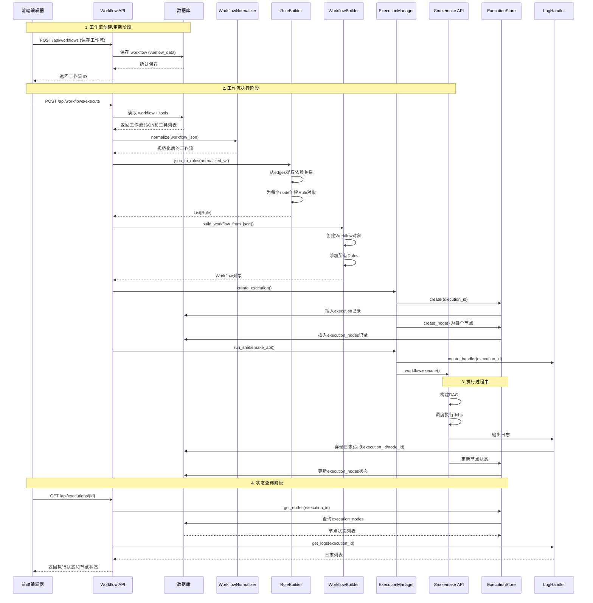
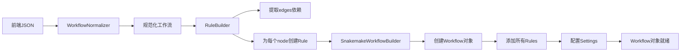

## 后端架构概述

### 架构状态摘要

**当前状态**: 基础架构已建立，但存在核心模块缺失和架构不一致问题
**主要问题**: `workflow_store` 模块缺失，存储机制不统一，Hot Run支持不足
**改进方向**: 修复核心架构，支持增量执行，优化Snakemake利用

后端已经完成重构，采用直接使用Snakemake API的方式执行工作流，不再生成Snakefile中间文件。但当前架构存在一些不一致和缺失，需要进一步优化以支持Hot Run等高级功能。

### 系统架构总览

TDEase系统采用前后端分离架构，通过数据库实现工作流和工具的持久化存储，支持实时执行和节点级别的状态跟踪。

**核心架构流程**:
```
前端JSON → WorkflowNormalizer → RuleBuilder → Workflow对象 → Snakemake API执行 → 日志/状态API
```

**旧架构（已弃用）**:
```
前端JSON → Compiler → Snakefile + config.yaml → CLI subprocess → 日志
```

### 系统架构图

```mermaid
graph TB
    subgraph Frontend["前端 (Vue.js)"]
        SL[Sample List<br/>样本列表]
        TL[Tool List<br/>工具列表]
        Editor[Editor<br/>工作流编辑器]
        Node1[Node 1]
        Node2[Node 2]
        Edge[Edge<br/>连接关系]
        
        SL --> Editor
        TL --> Editor
        Editor --> Node1
        Editor --> Node2
        Node1 -->|edge| Node2
    end
    
    subgraph API["后端 API (FastAPI)"]
        WF_API[Workflow API<br/>工作流管理]
        EXEC_API[Execution API<br/>执行管理]
        TOOL_API[Tool API<br/>工具管理]
        BATCH_API[Batch Config API<br/>批量配置]
    end
    
    subgraph Services["服务层 (app/services/)"]
        Normalizer[WorkflowNormalizer<br/>工作流规范化]
        RuleBuilder[RuleBuilder<br/>规则构建器]
        WFBuilder[SnakemakeWorkflowBuilder<br/>工作流构建器]
        ExecManager[ExecutionManager<br/>执行管理器]
        NodeMapper[NodeMapper<br/>节点映射器]
        ExecStore[ExecutionStore<br/>执行存储]
        LogHandler[LogHandler<br/>日志处理器]
    end
    
    subgraph Database["数据库 (SQLite)"]
        WF_TBL[(workflows<br/>工作流表)]
        EXEC_TBL[(executions<br/>执行记录表)]
        NODE_TBL[(execution_nodes<br/>节点执行表)]
        TOOL_TBL[(tools<br/>工具表)]
        BATCH_TBL[(batch_configs<br/>批量配置表)]
        FILE_TBL[(files<br/>文件表)]
    end
    
    subgraph Execution["执行引擎"]
        Snakemake[Snakemake API<br/>工作流执行引擎]
        Executor[Executor Plugin<br/>执行器插件]
        Scheduler[Scheduler Plugin<br/>调度器插件]
    end
    
    %% 前端到API
    Editor -->|POST /api/workflows| WF_API
    Editor -->|POST /api/workflows/execute| WF_API
    Editor -->|GET /api/tools| TOOL_API
    Editor -->|POST /api/batch-configs| BATCH_API
    
    %% API到服务层
    WF_API --> Normalizer
    WF_API --> RuleBuilder
    WF_API --> WFBuilder
    WF_API --> ExecManager
    
    %% 服务层处理流程
    Normalizer --> RuleBuilder
    RuleBuilder --> WFBuilder
    WFBuilder --> ExecManager
    ExecManager --> NodeMapper
    ExecManager --> ExecStore
    ExecManager --> LogHandler
    
    %% 执行流程
    ExecManager --> Snakemake
    Snakemake --> Executor
    Snakemake --> Scheduler
    
    %% 数据库交互
    WF_API <--> WF_TBL
    EXEC_API <--> EXEC_TBL
    EXEC_API <--> NODE_TBL
    TOOL_API <--> TOOL_TBL
    BATCH_API <--> BATCH_TBL
    ExecStore <--> EXEC_TBL
    ExecStore <--> NODE_TBL
    
    %% 日志和状态反馈
    LogHandler -->|日志| EXEC_API
    ExecStore -->|状态| EXEC_API
    EXEC_API -->|GET /api/executions/{id}| Editor
    
    style Frontend fill:#e1f5ff
    style API fill:#fff4e1
    style Services fill:#f0f0f0
    style Database fill:#e8f5e9
    style Execution fill:#fce4ec
```

### 数据流架构图



### 前后端交互架构

工作流和工具的注册均在我们所运行的平台上进行数据库方式的注册。前后端API以及数据库设计已完成。

**关键交互点**:
1. **工作流保存**: 前端编辑器修改 → 后端API → 数据库存储 (workflows表)
2. **工具注册**: 工具列表 → 工具API → 数据库存储 (tools表)
3. **批量配置**: 批量配置表单 → Batch Config API → 数据库存储 (batch_configs表，关联user_id)
4. **执行触发**: 前端执行请求 → Workflow API → 构建并执行工作流
5. **状态查询**: 前端轮询 → Execution API → 返回执行状态和节点状态

### 核心调用层实现

#### 1. 工作流构建 (app/services/)

- **rule_builder.py**: 将前端JSON DAG直接转换为Snakemake Rule对象
  - `json_to_rules()`: 从JSON构建规则列表
  - `node_to_rule()`: 单个节点转Rule对象
  - 直接从edges提取依赖关系，无需DAG分析

- **snakemake_workflow_builder.py**: 构建Snakemake Workflow对象
  - `build_workflow_from_json()`: 从JSON创建Workflow对象
  - 程序化添加规则，无需Snakefile
  - 配置所有必需的Settings对象

#### 2. 执行引擎 (app/services/)

- **snakemake_executor.py**: 通过Snakemake API执行工作流
  - 使用`Workflow.execute()`直接执行
  - 不再使用CLI subprocess
  - 支持executor plugin和scheduler plugin

- **runner.py**: 执行管理器
  - `run_snakemake_api()`: 新的API-based执行方法
  - 集成日志捕获和节点跟踪

#### 3. 节点级别跟踪

- **node_mapper.py**: 映射Snakemake jobs到前端节点
  - 命名约定: `rule_name = "node_{node_id}"`
  - 支持双向映射（rule ↔ node）

- **execution_store.py**: 数据库存储
  - `create_node()`: 创建节点执行记录
  - `update_node_status()`: 更新节点状态
  - `get_nodes()`: 获取所有节点状态

#### 4. 日志系统

- **log_handler.py**: 捕获Snakemake日志
  - `ExecutionLogHandler`: 自定义日志处理器
  - 关联日志与execution_id和node_id
  - 支持按节点/级别过滤

### 数据库设计

数据库采用SQLite，包含以下核心表：

#### 1. workflows 表
- **id**: 工作流唯一标识符
- **name**: 工作流名称
- **description**: 工作流描述
- **vueflow_data**: VueFlow JSON数据结构（包含nodes、edges、metadata等）
- **workspace_path**: 用户工作空间路径
- **status**: 工作流状态 (created/compiled/running/completed/failed)
- **batch_config**: 批量配置JSON（可选）
- **created_at/updated_at**: 创建和更新时间

#### 2. executions 表
- **id**: 执行唯一标识符
- **workflow_id**: 关联的工作流ID
- **status**: 执行状态 (pending/running/completed/failed/cancelled)
- **start_time/end_time**: 执行时间
- **workspace_path**: 工作空间路径
- **snakemake_args**: Snakemake参数（JSON格式）
- **config_overrides**: 配置覆盖（JSON格式）

#### 3. execution_nodes 表（节点级别跟踪）
- **id**: 节点记录唯一标识符
- **execution_id**: 关联的执行ID
- **node_id**: 前端节点ID
- **rule_name**: Snakemake规则名称（格式: "node_{node_id}"）
- **status**: 节点执行状态 (pending/running/completed/failed)
- **start_time/end_time**: 节点执行时间
- **progress**: 节点执行进度 (0-100)
- **log_path**: 节点日志路径
- **error_message**: 错误信息（如果失败）

#### 4. tools 表
- **name**: 工具名称（主键）
- **version**: 工具版本
- **description**: 工具描述
- **category**: 工具分类
- **executable_path**: 可执行文件路径
- **is_available**: 是否可用（0/1）
- **platform_info**: 平台相关信息（JSON格式）
- **metadata**: 工具元数据（JSON格式）

#### 5. batch_configs 表
- **id**: 批量配置唯一标识符
- **user_id**: 用户ID（关联用户）
- **name**: 配置名称
- **description**: 配置描述
- **config_data**: 批量配置数据（JSON格式，包含samples列表）
- **is_shared**: 是否共享（0/1）
- **created_at/updated_at**: 创建和更新时间

#### 6. files 表
- **id**: 文件唯一标识符
- **filename**: 原始文件名
- **safe_filename**: 安全文件名
- **file_path**: 完整文件路径
- **workspace_path**: 所在的工作空间
- **size**: 文件大小（字节）
- **mime_type**: MIME类型
- **uploaded_at**: 上传时间

### API端点

#### 工作流管理API (app/api/workflow.py)

- `GET /api/workflows`: 获取工作流列表（支持分页）
- `GET /api/workflows/{workflow_id}`: 获取工作流详情
- `POST /api/workflows`: 创建工作流
- `PUT /api/workflows/{workflow_id}`: 更新工作流
- `DELETE /api/workflows/{workflow_id}`: 删除工作流
- `POST /api/workflows/execute`: 直接执行工作流（从前端JSON）
  - 使用新的workflow builder
  - 不再生成Snakefile
  - 直接构建Workflow对象并执行
- `POST /api/workflows/{workflow_id}/execute`: 执行已保存的工作流
- `POST /api/workflows/{workflow_id}/execute-batch`: 批量执行工作流

#### 执行管理API (app/api/execution.py)

- `GET /api/executions/{execution_id}`: 获取执行状态（包含节点状态）
- `GET /api/executions/{execution_id}/logs`: 获取日志（支持节点过滤）
  - 查询参数: `node_id`, `level`, `limit`
- `GET /api/executions/{execution_id}/nodes`: 获取所有节点状态
- `GET /api/executions/{execution_id}/nodes/{node_id}`: 获取特定节点状态
- `POST /api/executions/{execution_id}/stop`: 停止执行

#### 工具管理API (app/api/tools.py)

- `GET /api/tools/schemas`: 获取工具注册表schemas
- `GET /api/tools/discovery`: 发现系统可用工具
- `GET /api/tools/registered`: 获取已注册工具列表
- `GET /api/tools/{tool_name}`: 获取特定工具信息
- `POST /api/tools/register`: 注册新工具
- `PUT /api/tools/{tool_name}`: 更新工具信息
- `DELETE /api/tools/{tool_name}`: 注销工具
- `POST /api/tools/search`: 搜索工具
- `POST /api/tools/refresh`: 刷新工具发现

#### 批量配置API (app/api/batch_config.py)

- `POST /api/batch-configs/`: 创建批量配置
- `GET /api/batch-configs/`: 获取用户的批量配置列表
- `GET /api/batch-configs/{config_id}`: 获取特定批量配置
- `PUT /api/batch-configs/{config_id}`: 更新批量配置
- `DELETE /api/batch-configs/{config_id}`: 删除批量配置

### 执行流程详解

#### 1. 工作流构建流程



#### 2. 执行流程

1. **初始化阶段**:
   - 创建execution记录
   - 为每个节点创建execution_node记录
   - 注册NodeMapper映射关系
   - 创建日志处理器

2. **构建阶段**:
   - 配置Workflow Settings (DAG, Execution, Resource等)
   - 调用`workflow._prepare_dag()`准备DAG
   - 调用`workflow._build_dag()`构建DAG

3. **执行阶段**:
   - 获取executor plugin (local)
   - 获取scheduler plugin (greedy)
   - 调用`workflow.execute()`执行
   - 在异步线程池中运行（因为execute是同步的）

4. **监控阶段**:
   - LogHandler捕获Snakemake日志
   - ExecutionStore更新节点状态
   - 前端通过API轮询获取状态

#### 3. 节点映射机制

- **命名约定**: `rule_name = "node_{node_id}"`
- **双向映射**: 
  - `NodeMapper.node_id_to_rule_name()`: node_id → rule_name
  - `NodeMapper.rule_name_to_node_id()`: rule_name → node_id
- **Job映射**: 支持job_id到node_id的映射（用于跟踪实际执行的job）

### Hot Run模式（计划中）

根据架构图描述，系统计划支持Hot Run模式：
- **目标**: 前端每增加或修改一个节点，后端立即运行该节点
- **实现方式**: 
  - 监听前端节点变更事件
  - 仅构建和执行变更的节点及其依赖
  - 使用增量DAG构建
  - 支持部分工作流执行

### 关键优势

1. **无需文件生成**: 完全程序化构建，无中间文件（Snakefile、config.yaml）
2. **节点级别跟踪**: 可以监控每个节点的执行状态、进度和日志
3. **实时日志**: 通过API获取实时日志，支持按节点/级别过滤
4. **直接API调用**: 使用Snakemake核心执行引擎，不依赖CLI subprocess
5. **前端DAG即后端DAG**: 前端JSON已经是DAG结构（nodes+edges），无需额外DAG分析
6. **批量处理支持**: 支持批量配置和批量执行，类似Snakemake的config.yaml功能
7. **工具注册管理**: 完整的工具发现、注册、管理机制

### 已弃用组件

- **compiler.py**: `compile_workflow()`函数已标记为DEPRECATED
  - 仍保留用于向后兼容（如compile端点）
  - 新代码应使用`SnakemakeWorkflowBuilder.build_workflow_from_json()`

### 架构问题与改进计划

#### 当前架构问题识别

通过代码分析，发现当前架构存在以下问题：

1. **模块缺失**: `workflow_store.py` 模块在代码中引用但实际不存在
2. **存储不一致**: 工作流数据分散在数据库和文件系统，缺乏统一管理
3. **状态管理分散**: 工作流状态、执行状态、节点状态管理不统一
4. **增量执行支持不足**: 每次执行都重新构建整个工作流，不支持Hot Run
5. **Snakemake功能利用不充分**: 未充分利用Snakemake的增量执行、资源管理等功能

#### 架构改进方案

##### 1. 核心架构修复
- **创建 `WorkflowStore` 类**: 统一工作流存储管理
- **统一存储机制**: 明确数据存储位置和方式
- **修复API不一致**: 修复 `execute` 端点中的模块导入问题

##### 2. Hot Run模式支持
- **工作流版本管理**: 每次修改创建新版本，支持版本回滚
- **增量DAG构建**: 只构建变化的节点及其依赖
- **节点状态跟踪**: 完善节点状态持久化和跟踪
- **增量执行**: 利用Snakemake的增量执行功能

##### 3. Snakemake优化
- **增量执行支持**: 使用 `--until`、`--rerun-triggers` 等参数
- **资源管理优化**: 根据节点类型智能分配资源
- **检查点支持**: 支持工作流暂停和恢复
- **参数化优化**: 更好地利用params和wildcards

##### 4. 状态管理优化
- **统一状态模型**: 创建 `WorkflowState` 类统一管理状态
- **实时状态同步**: 支持WebSocket实时推送状态更新
- **状态持久化**: 确保状态不丢失，支持恢复

#### 实施计划

**第一阶段：核心修复** (优先级: 高)
1. 创建 `WorkflowStore` 类
2. 修复 `execute` 端点中的模块导入问题
3. 统一工作流存储机制

**第二阶段：Hot Run支持** (优先级: 中)
1. 实现工作流版本管理
2. 实现增量DAG构建
3. 实现增量执行支持

**第三阶段：优化增强** (优先级: 低)
1. 优化Snakemake功能利用
2. 实现WebSocket实时状态同步
3. 添加资源监控和优化

#### 数据库扩展设计

```sql
-- 工作流版本表
CREATE TABLE workflow_versions (
    id TEXT PRIMARY KEY,
    workflow_id TEXT NOT NULL,
    version INTEGER NOT NULL,
    vueflow_data TEXT NOT NULL,
    created_at TEXT NOT NULL,
    changes TEXT,  -- JSON描述变更内容
    FOREIGN KEY (workflow_id) REFERENCES workflows(id),
    UNIQUE(workflow_id, version)
);

-- 节点依赖关系表
CREATE TABLE node_dependencies (
    id TEXT PRIMARY KEY,
    workflow_id TEXT NOT NULL,
    node_id TEXT NOT NULL,
    depends_on TEXT,  -- JSON数组，依赖的节点ID列表
    created_at TEXT NOT NULL,
    FOREIGN KEY (workflow_id) REFERENCES workflows(id)
);

-- 工作流状态快照表
CREATE TABLE workflow_state_snapshots (
    id TEXT PRIMARY KEY,
    workflow_id TEXT NOT NULL,
    execution_id TEXT NOT NULL,
    state_data TEXT NOT NULL,  -- JSON格式的完整状态
    created_at TEXT NOT NULL,
    FOREIGN KEY (workflow_id) REFERENCES workflows(id),
    FOREIGN KEY (execution_id) REFERENCES executions(id)
);
```

#### 新的API端点设计

```python
# Hot Run相关API
@router.post("/{workflow_id}/hot-run")  # Hot Run执行
@router.get("/{workflow_id}/versions")  # 获取版本列表
@router.post("/{workflow_id}/versions/{version_id}/restore")  # 恢复版本
@router.get("/{workflow_id}/dependencies")  # 获取依赖关系
@router.post("/{workflow_id}/incremental-build")  # 增量构建

# 状态管理API
@router.get("/{workflow_id}/state")  # 获取工作流状态
@router.post("/{workflow_id}/state/snapshot")  # 创建状态快照
@router.get("/{workflow_id}/state/history")  # 获取状态历史
@router.ws("/{workflow_id}/state/ws")  # WebSocket状态推送
```

#### 预期收益

1. **性能提升**: 增量执行减少不必要的计算
2. **用户体验改善**: Hot Run提供即时反馈
3. **资源利用率提高**: 智能资源分配减少浪费
4. **系统稳定性增强**: 统一的状态管理和错误处理
5. **扩展性提升**: 模块化设计支持未来功能扩展


