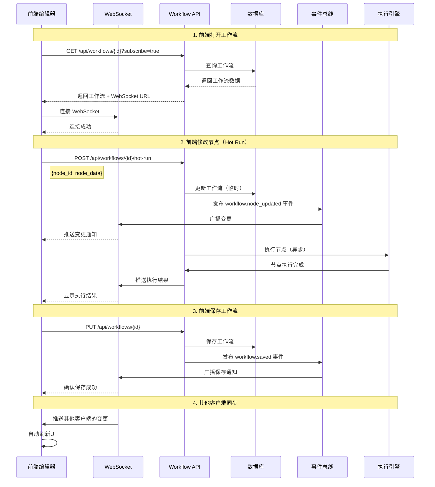

# 节点模式执行与前后端同步方案

## 📋 概述

本文档回答以下关键问题：
1. **基于Snakemake的运行调度模式，是否可以做到节点模式的运行？**
2. **前后端与数据库的同步机制？**
3. **前端打开一个workflow，后端则直接进行刷新？**

## 1. 节点模式运行（Node-Level Execution）

### 1.1 Snakemake支持的部分执行机制

Snakemake的`DAGSettings`提供了多种参数来支持部分执行：

```python
@dataclass
class DAGSettings(SettingsBase):
    targets: AnySet[str] = frozenset()      # 指定要执行的目标规则
    forcetargets: bool = False              # 强制执行目标
    forcerun: AnySet[str] = frozenset()     # 强制重新运行指定规则
    until: AnySet[str] = frozenset()        # 执行到指定规则为止
    omit_from: AnySet[str] = frozenset()    # 排除指定规则
    prioritytargets: AnySet[str] = frozenset()  # 优先执行的目标
```

### 1.2 实现节点模式执行的方案

#### 方案A：使用targets参数（推荐）

```python
# 在 runner.py 中修改 run_snakemake_api 方法
async def run_snakemake_api(
    self,
    ex: Execution,
    workflow: Workflow,
    rules: list[Rule],
    node_mapper: NodeMapper,
    cores: int = 4,
    use_conda: bool = True,
    target_nodes: Optional[List[str]] = None  # 新增：指定要执行的节点ID列表
):
    """执行工作流，支持节点级别的部分执行"""
    
    # 如果指定了target_nodes，只执行这些节点及其依赖
    if target_nodes:
        # 将节点ID转换为规则名称
        target_rules = [
            node_mapper.node_id_to_rule_name(node_id) 
            for node_id in target_nodes
        ]
        
        # 设置DAGSettings的targets
        dag_settings = DAGSettings(
            targets=frozenset(target_rules),
            forcetargets=True  # 强制执行这些目标
        )
    else:
        # 执行整个工作流
        dag_settings = DAGSettings()
    
    workflow.dag_settings = dag_settings
    # ... 后续执行逻辑
```

#### 方案B：使用until参数（执行到指定节点）

```python
# 执行到指定节点为止（包括该节点及其所有依赖）
dag_settings = DAGSettings(
    until=frozenset([node_mapper.node_id_to_rule_name(node_id)])
)
```

#### 方案C：使用forcerun参数（强制重新运行）

```python
# 强制重新运行指定节点（即使输出已存在）
dag_settings = DAGSettings(
    forcerun=frozenset([node_mapper.node_id_to_rule_name(node_id)])
)
```

### 1.3 API端点设计

```python
# app/api/workflow.py

@router.post("/{workflow_id}/execute-node")
async def execute_node(
    workflow_id: str,
    node_id: str,  # 要执行的节点ID
    db=Depends(get_database)
):
    """执行单个节点及其依赖"""
    # 1. 获取工作流
    workflow_data = await get_workflow_from_database(db, workflow_id)
    
    # 2. 构建工作流（只包含该节点及其依赖）
    workflow, rules, tools_registry = build_workflow_from_json(...)
    
    # 3. 设置DAGSettings只执行该节点
    dag_settings = DAGSettings(
        targets=frozenset([f"node_{node_id}"]),
        forcetargets=True
    )
    
    # 4. 执行
    execution_id = await execute_workflow_with_settings(
        workflow, dag_settings, ...
    )
    
    return {"execution_id": execution_id, "node_id": node_id}

@router.post("/{workflow_id}/execute-nodes")
async def execute_nodes(
    workflow_id: str,
    node_ids: List[str],  # 要执行的节点ID列表
    db=Depends(get_database)
):
    """批量执行多个节点"""
    # 类似实现，但targets包含多个节点
    target_rules = [f"node_{nid}" for nid in node_ids]
    dag_settings = DAGSettings(
        targets=frozenset(target_rules),
        forcetargets=True
    )
    # ... 执行逻辑
```

### 1.4 Hot Run模式实现

根据架构图描述，Hot Run模式的目标是：**前端每增加或修改一个节点，后端立即运行该节点**

```python
# app/api/workflow.py

@router.post("/{workflow_id}/hot-run")
async def hot_run_node(
    workflow_id: str,
    node_id: str,
    node_data: dict,  # 节点的新数据
    db=Depends(get_database)
):
    """Hot Run模式：立即执行修改的节点"""
    # 1. 更新工作流中的节点数据（不保存到数据库）
    workflow_data = await get_workflow_from_database(db, workflow_id)
    # 更新内存中的节点数据
    
    # 2. 构建工作流（包含该节点及其依赖）
    workflow, rules, _ = build_workflow_from_json(workflow_data)
    
    # 3. 只执行该节点及其依赖
    dag_settings = DAGSettings(
        targets=frozenset([f"node_{node_id}"]),
        forcetargets=True
    )
    
    # 4. 异步执行（不阻塞）
    execution_id = str(uuid4())
    asyncio.create_task(
        execute_workflow_async(workflow, dag_settings, execution_id)
    )
    
    return {
        "execution_id": execution_id,
        "node_id": node_id,
        "status": "running"
    }
```

## 2. 前后端与数据库的同步机制

### 2.1 当前同步机制

**现状**：
- 前端修改工作流 → 调用 `PUT /api/workflows/{id}` → 后端保存到数据库
- 前端通过轮询或WebSocket获取执行状态
- **问题**：前端修改后，需要手动保存；后端无法主动推送变更

### 2.2 改进方案：双向实时同步

#### 方案A：WebSocket实时同步（推荐）

```python
# app/core/websocket.py 扩展

class ConnectionManager:
    """扩展WebSocket管理器支持工作流变更同步"""
    
    # 工作流变更订阅者（按workflow_id分组）
    workflow_change_subscribers: Dict[str, Set[str]] = {}
    
    async def subscribe_workflow_changes(
        self, 
        websocket: WebSocket, 
        workflow_id: str
    ) -> str:
        """订阅工作流变更"""
        connection_id = await self.connect(websocket, workflow_id)
        
        if workflow_id not in self.workflow_change_subscribers:
            self.workflow_change_subscribers[workflow_id] = set()
        self.workflow_change_subscribers[workflow_id].add(connection_id)
        
        return connection_id
    
    async def broadcast_workflow_change(
        self, 
        workflow_id: str, 
        change_type: str,  # 'node_added', 'node_updated', 'node_deleted', 'edge_added', etc.
        change_data: dict
    ):
        """广播工作流变更"""
        if workflow_id not in self.workflow_change_subscribers:
            return
        
        message = {
            "type": "workflow_change",
            "workflow_id": workflow_id,
            "change_type": change_type,
            "data": change_data,
            "timestamp": datetime.utcnow().isoformat()
        }
        
        await self.broadcast_to_workflow(workflow_id, message)
```

#### 方案B：数据库触发器 + 轮询

```python
# 使用SQLite的触发器检测变更（需要扩展）

# 1. 创建触发器
CREATE TRIGGER workflow_change_trigger
AFTER UPDATE ON workflows
BEGIN
    INSERT INTO workflow_changes (workflow_id, change_type, change_data, timestamp)
    VALUES (NEW.id, 'updated', NEW.vueflow_data, datetime('now'));
END;

# 2. 前端轮询变更
@router.get("/{workflow_id}/changes")
async def get_workflow_changes(
    workflow_id: str,
    since: Optional[str] = None,  # 时间戳
    db=Depends(get_database)
):
    """获取工作流变更"""
    query = """
        SELECT * FROM workflow_changes 
        WHERE workflow_id = ? AND timestamp > ?
        ORDER BY timestamp DESC
    """
    # ... 返回变更列表
```

#### 方案C：事件驱动架构

```python
# app/core/events.py

from typing import Callable, Dict, List
import asyncio

class WorkflowEventBus:
    """工作流事件总线"""
    
    def __init__(self):
        self.subscribers: Dict[str, List[Callable]] = {}
    
    def subscribe(self, event_type: str, handler: Callable):
        """订阅事件"""
        if event_type not in self.subscribers:
            self.subscribers[event_type] = []
        self.subscribers[event_type].append(handler)
    
    async def publish(self, event_type: str, data: dict):
        """发布事件"""
        if event_type in self.subscribers:
            for handler in self.subscribers[event_type]:
                await handler(data)

# 全局事件总线
event_bus = WorkflowEventBus()

# 在工作流更新时发布事件
@router.put("/{workflow_id}")
async def update_workflow(...):
    # ... 更新逻辑
    await save_workflow_to_database(db, workflow_data)
    
    # 发布变更事件
    await event_bus.publish("workflow.updated", {
        "workflow_id": workflow_id,
        "changes": diff_data
    })
    
    return response
```

### 2.3 前端同步实现

```typescript
// TDEase-FrontEnd/src/services/workflow/sync.ts

export class WorkflowSyncService {
    private ws: WebSocket | null = null
    private workflowId: string | null = null
    
    // 订阅工作流变更
    subscribe(workflowId: string, onChange: (change: WorkflowChange) => void) {
        this.workflowId = workflowId
        this.ws = new WebSocket(`ws://api/ws/${workflowId}`)
        
        this.ws.onmessage = (event) => {
            const message = JSON.parse(event.data)
            if (message.type === 'workflow_change') {
                onChange(message.data)
            }
        }
    }
    
    // 发送变更到后端
    async sendChange(changeType: string, changeData: any) {
        // 1. 立即更新本地状态
        // 2. 发送到后端
        await workflowApi.updateWorkflow(this.workflowId, changeData)
        // 3. 后端会通过WebSocket广播给所有订阅者
    }
}
```

## 3. 前端打开workflow后端自动刷新

### 3.1 实现方案

#### 方案A：WebSocket自动订阅（推荐）

```python
# app/api/workflow.py

@router.get("/{workflow_id}")
async def get_workflow(
    workflow_id: str,
    subscribe: bool = False,  # 是否订阅变更
    db=Depends(get_database)
):
    """获取工作流，可选择订阅实时更新"""
    workflow = await get_workflow_from_database(db, workflow_id)
    
    response = WorkflowResponse(...)
    
    # 如果前端请求订阅，返回WebSocket连接信息
    if subscribe:
        response.websocket_url = f"ws://api/ws/{workflow_id}"
        response.subscription_token = generate_token(workflow_id)
    
    return response
```

#### 方案B：Server-Sent Events (SSE)

```python
# app/api/workflow.py

from fastapi.responses import StreamingResponse

@router.get("/{workflow_id}/stream")
async def stream_workflow_updates(workflow_id: str):
    """SSE流式推送工作流更新"""
    async def event_generator():
        last_version = None
        while True:
            # 检查数据库中的工作流版本
            current = await get_workflow_version(workflow_id)
            if current != last_version:
                yield f"data: {json.dumps(current)}\n\n"
                last_version = current
            await asyncio.sleep(1)  # 轮询间隔
    
    return StreamingResponse(
        event_generator(),
        media_type="text/event-stream"
    )
```

#### 方案C：数据库变更监听

```python
# app/core/db_watcher.py

import asyncio
from watchdog.observers import Observer
from watchdog.events import FileSystemEventHandler

class WorkflowDBWatcher:
    """监听数据库变更"""
    
    def __init__(self, db_path: str):
        self.db_path = db_path
        self.observers = {}
    
    async def watch_workflow(self, workflow_id: str, callback: Callable):
        """监听特定工作流的变更"""
        # 使用SQLite的WAL模式 + 轮询
        # 或者使用文件系统监听（如果工作流有文件存储）
        while True:
            # 检查updated_at字段
            last_check = await get_workflow_updated_at(workflow_id)
            current = await get_workflow_updated_at(workflow_id)
            if current > last_check:
                await callback(workflow_id)
            await asyncio.sleep(0.5)
```

### 3.2 前端实现

```typescript
// TDEase-FrontEnd/src/pages/workflow.vue

export default {
    async mounted() {
        const workflowId = this.$route.params.id
        
        // 1. 加载工作流
        const workflow = await WorkflowService.getWorkflow(workflowId, {
            subscribe: true  // 请求订阅
        })
        
        // 2. 建立WebSocket连接
        this.syncService = new WorkflowSyncService()
        this.syncService.subscribe(workflowId, (change) => {
            // 自动刷新工作流数据
            this.handleWorkflowChange(change)
        })
        
        // 3. 监听本地变更并同步
        this.$watch('workflowData', (newVal, oldVal) => {
            // 检测变更并发送到后端
            const changes = this.detectChanges(oldVal, newVal)
            this.syncService.sendChanges(changes)
        }, { deep: true })
    },
    
    methods: {
        handleWorkflowChange(change: WorkflowChange) {
            // 应用后端推送的变更
            switch (change.change_type) {
                case 'node_added':
                    this.addNode(change.data.node)
                    break
                case 'node_updated':
                    this.updateNode(change.data.node_id, change.data.node)
                    break
                case 'node_deleted':
                    this.deleteNode(change.data.node_id)
                    break
                // ...
            }
        }
    }
}
```

## 4. 完整实现架构图



## 5. 实施建议

### 5.1 优先级

1. **高优先级**：节点模式执行（使用targets参数）
2. **中优先级**：WebSocket实时同步
3. **低优先级**：Hot Run模式（需要增量DAG构建）

### 5.2 实施步骤

#### Phase 1: 节点模式执行
- [ ] 修改`runner.py`支持target_nodes参数
- [ ] 添加`POST /api/workflows/{id}/execute-node`端点
- [ ] 前端添加"执行节点"按钮

#### Phase 2: WebSocket同步
- [ ] 扩展`ConnectionManager`支持工作流变更订阅
- [ ] 在工作流更新时广播变更事件
- [ ] 前端实现WebSocket客户端和自动刷新

#### Phase 3: Hot Run模式
- [ ] 实现增量DAG构建
- [ ] 添加`POST /api/workflows/{id}/hot-run`端点
- [ ] 前端实现节点修改时的自动执行

## 6. 技术细节

### 6.1 DAGSettings完整参数

```python
dag_settings = DAGSettings(
    targets=frozenset(["node_1", "node_2"]),  # 要执行的目标
    forcetargets=True,                         # 强制执行目标
    forcerun=frozenset(["node_3"]),           # 强制重新运行
    until=frozenset(["node_4"]),              # 执行到该节点
    omit_from=frozenset(["node_5"]),          # 排除该节点
    prioritytargets=frozenset(["node_1"]),    # 优先执行
    batch=None,                                # 批量执行
    forceall=False,                            # 强制全部执行
    force_incomplete=False,                    # 强制不完整执行
)
```

### 6.2 依赖关系处理

当执行单个节点时，Snakemake会自动：
1. 识别该节点的所有依赖节点
2. 按依赖顺序执行
3. 只执行必要的节点（如果依赖已存在且未变更）

### 6.3 性能考虑

- **增量执行**：只执行变更的节点，节省时间
- **依赖缓存**：已执行的节点结果可以复用
- **并发执行**：Snakemake自动处理可并行的节点

## 7. 总结

✅ **节点模式运行**：完全可行，使用`DAGSettings.targets`参数
✅ **前后端同步**：通过WebSocket实现实时双向同步
✅ **自动刷新**：前端打开workflow时自动订阅，后端推送变更

这些功能可以显著提升用户体验，实现真正的实时协作和增量执行。

